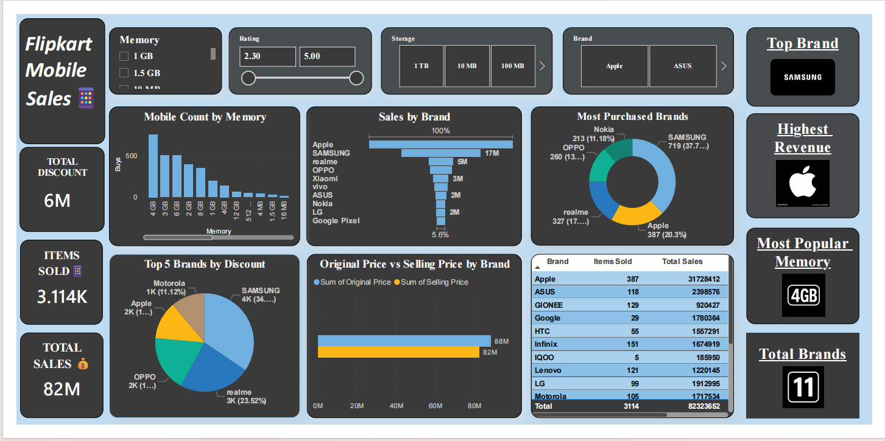

# 📱 Flipkart Mobile Sales Analysis Dashboard

## 📌 Project Overview

This project presents an interactive Power BI dashboard developed to analyze Flipkart mobile sales data. The dashboard provides insights into brand performance, sales trends, discount patterns, customer preferences, and product configurations, enabling data-driven decision-making.

The objective of this project is to transform raw sales data into meaningful business insights through effective data visualization and analytics.

---

## 🎯 Objectives

- Analyze overall mobile sales performance.
- Identify top-performing brands based on sales and revenue.
- Evaluate discount trends across different brands.
- Understand customer preferences based on memory and storage configurations.
- Create an interactive dashboard for business stakeholders.

---

## 📊 Dashboard Features

### KPI Metrics
- Total Sales
- Total Discount Amount
- Total Products

### Business Insight Cards
- Top Brand
- Highest Revenue Brand
- Most Popular Memory Configuration
- Total Number of Brands

### Visualizations
- Sales by Brand
- Mobile Count by Memory
- Top Brands by Discount
- Original Price vs Selling Price Analysis
- Brand-wise Sales Summary

### Interactive Filters
- Brand
- Memory
- Storage
- Rating

---

## 🔍 Key Insights

- Samsung emerged as the most purchased mobile brand.
- Apple generated the highest revenue among all brands.
- 4GB RAM was the most preferred memory configuration.
- Significant price differences were observed between original and selling prices, highlighting discount opportunities.
- Brand-wise analysis revealed varying sales and discount patterns across the marketplace.

---

## 🛠️ Tools & Technologies Used

| Tool | Purpose |
|--------|----------|
| Power BI | Dashboard Development |
| Power Query | Data Cleaning & Transformation |
| DAX | KPI Calculations & Measures |
| Excel / CSV | Data Source |
| Data Modeling | Relationship Management |

---

## 📂 Project Structure

```text
Flipkart-Mobile-Sales-Dashboard/
│
├── Flipkart-Mobile-Sales-Dashboard.pbix
├── Dashboard.pdf
├── Dashboard_Screenshot.png
├── Dataset.csv
└── README.md
```

---

## 📸 Dashboard Preview



---

## 🚀 Skills Demonstrated

- Data Cleaning
- Data Transformation
- Data Modeling
- DAX Calculations
- Data Visualization
- Business Analytics
- Dashboard Design
- Storytelling with Data

---

## 📈 Business Value

This dashboard enables stakeholders to:
- Monitor sales performance.
- Compare brand-wise revenue.
- Track discount effectiveness.
- Identify customer purchasing trends.
- Support strategic business decisions through data-driven insights.

---

## 👨‍💻 Author

**Hari Gowtham**

Aspiring Data Analyst | Power BI Enthusiast | Python & SQL Learner

### Connect With Me
- LinkedIn: https://www.linkedin.com/in/harigowtham2005/
- GitHub: https://github.com/harigowtham2005

---

## ⭐ If you found this project useful, please consider giving it a star.
